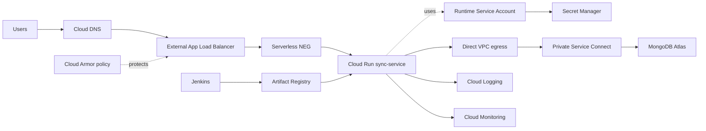

# Part 2 - GCP Architecture Diagram

The service is exposed through an external Application Load Balancer. Cloud
Armor is attached as a security policy, and Cloud Run is reached through a
serverless NEG. Direct public access to the default Cloud Run URL is blocked
by ingress settings.

Runtime secrets are read from Secret Manager using the Cloud Run runtime
service account. MongoDB traffic uses Direct VPC egress and Private Service
Connect to reach MongoDB Atlas privately.
